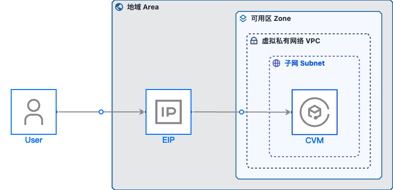

# 云应用模板-CVM与公网IP


## 云资源清单

- `CVM 实例`
- `公网 EIP`

## 部署架构图



## 目录说明

.cloudapp：云应用根目录
 - infrastructure：资源及变量定义目录
    - variable.tf：变量定义
    - deployment.tf：资源定义
    - provider.tf：全局公共参数（固定不变）
 - scripts：执行脚本（启动、初始化等）
    - startup.sh：启动脚本

## 使用说明
- 通常，你需要根据自身项目架构及资源需求修改 ```.cloudapp/infrastructure/variable.tf``` 的变量内容，具体修改部分参照文件中的注释说明。

- 你需要修改 ```.cloudapp/package.yaml``` 中的 ```id``` 为自己的云应用ID

- 需要将 ```.cloudapp/scripts``` 目录下的脚本，按照自身项目需求修改，并打包到CVM镜像的 ```/usr/local/cloudapp``` 目录下，在安装实例时，会执行相应的启动脚本

- 在CVM初始化时，将会自动执行 ```/usr/local/cloudapp/startup.sh``` 启动脚本
